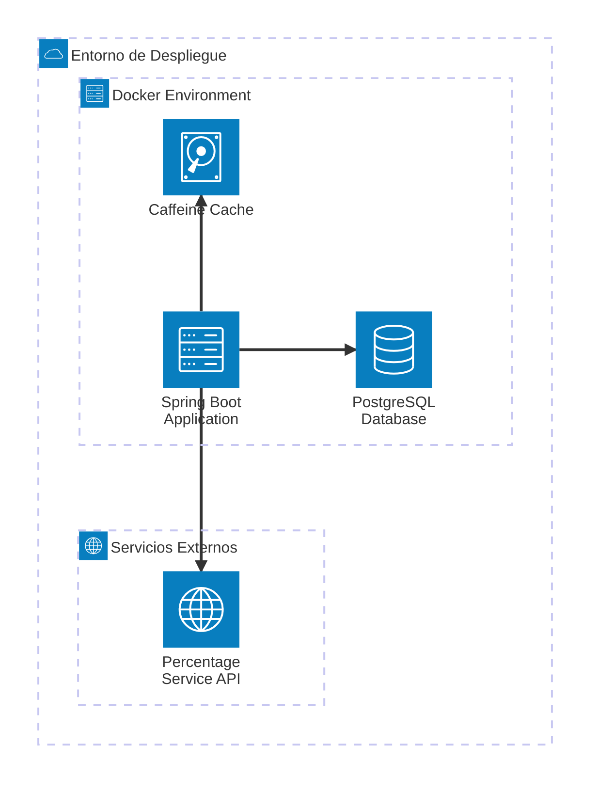

# Diagrama de Arquitectura (Despliegue)

## Descripción de Componentes

### Spring Boot Application
- **Puerto**: 8080
- **Tecnologías**: Spring Boot, Spring Data JPA, Spring Events
- **Funcionalidades**:
  - API REST para cálculos con porcentajes
  - API REST para consulta de historial
  - Gestión de eventos asíncronos
  - Validación de entrada
  - Manejo de excepciones global

### PostgreSQL Database
- **Puerto**: 5432
- **Esquema**: call_history table
- **Características**:
  - Soporte JSONB para datos flexibles
  - Índices optimizados para consultas
  - Versionado optimista con campo version

### Caffeine Cache
- **Tipo**: In-memory cache
- **Propósito**: Almacenar porcentajes del servicio externo
- **TTL**: Configurable
- **Estrategia**: Fallback cuando el servicio externo falla

### Percentage Service API
- **Tipo**: Mock/External Service
- **Propósito**: Proveer porcentajes dinámicos
- **Resiliencia**: Circuit breaker pattern con cache fallback

## Flujo de Datos

1. Cliente HTTP → Spring Boot Application (POST /api/v1/calculate)
2. Application → Percentage Service API (obtener porcentaje)
3. Application → Caffeine Cache (guardar/recuperar porcentaje)
4. Application → Domain Service (ejecutar cálculo)
5. Application → Event Publisher (publicar evento)
6. Event Listener → PostgreSQL (guardar historial asíncronamente)
7. Application → Cliente HTTP (respuesta JSON)

## Patrones de Arquitectura

- **Hexagonal Architecture (Ports & Adapters)**
- **Domain-Driven Design (DDD)**
- **Event-Driven Architecture**
- **Repository Pattern**
- **Cache-Aside Pattern**
