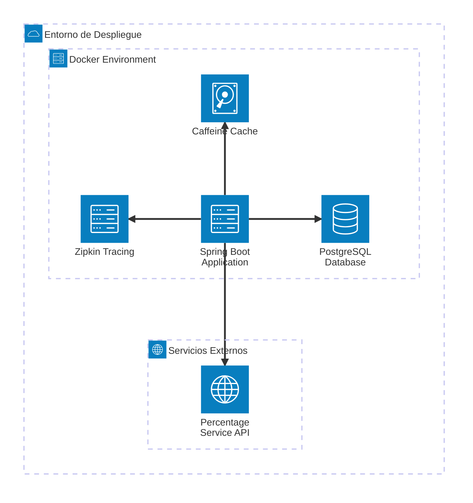

# Diagrama de Arquitectura (Despliegue)

## Descripción de Componentes

### Spring Boot Application
- **Puerto**: 8080
- **Tecnologías**: Spring Boot, Spring Data JPA, Spring Events, Micrometer Tracing
- **Funcionalidades**:
  - API REST para cálculos con porcentajes
  - API REST para consulta de historial
  - Gestión de eventos asíncronos
  - Validación de entrada
  - Manejo de excepciones global
  - Distributed tracing con Zipkin

### PostgreSQL Database
- **Puerto**: 5432
- **Esquema**: call_history table
- **Características**:
  - Soporte JSONB para datos flexibles
  - Índices optimizados para consultas (B-Tree y GIN)
  - Versionado optimista con campo version
  - Query tracing integrado

### Caffeine Cache
- **Tipo**: In-memory cache
- **Propósito**: Almacenar porcentajes del servicio externo
- **TTL**: Configurable (30 minutos por defecto)
- **Estrategia**: Fallback cuando el servicio externo falla

### Zipkin Tracing
- **Puerto**: 9411
- **Tipo**: Distributed tracing system
- **Funcionalidades**:
  - Rastreo completo de requests HTTP
  - Trazas de eventos asíncronos
  - Monitoreo de queries SQL (JDBC tracing)
  - Visualización de latencia por componente

### Percentage Service API
- **Tipo**: Mock/External Service
- **Propósito**: Proveer porcentajes dinámicos
- **Resiliencia**: Circuit breaker pattern con cache fallback

## Flujo de Datos

1. **Cliente HTTP** → Spring Boot Application (POST /api/v1/calculate)
2. **Application** → Percentage Service API (obtener porcentaje)
3. **Application** → Caffeine Cache (guardar/recuperar porcentaje)
4. **Application** → Domain Service (ejecutar cálculo)
5. **Application** → CalculationEventPort (publicar evento)
6. **Event Publisher** → Spring Events (publicar CalculationSuccessEvent/FailureEvent)
7. **Event Listener** → CallHistoryFactory (crear entidad CallHistory)
8. **Event Listener** → PostgreSQL (guardar historial asíncronamente)
9. **Application** → Cliente HTTP (respuesta JSON)
10. **Tracing** → Zipkin (enviar spans de cada operación)

## Patrones de Arquitectura

- **Hexagonal Architecture (Ports & Adapters)**
  - Domain independiente de frameworks
  - Puertos de entrada (in) y salida (out)
  - Adaptadores para infraestructura
  
- **Domain-Driven Design (DDD)**
  - Value Objects inmutables
  - Domain Services para lógica de negocio
  - Aggregates para consistencia

- **Event-Driven Architecture**
  - Eventos de dominio (CalculationSuccessEvent, CalculationFailureEvent)
  - Publicación asíncrona mediante Spring Events
  - Listener desacoplado para persistencia

- **Repository Pattern**
  - CallHistoryRepositoryPort (interfaz de dominio)
  - CallHistoryJpaAdapter (implementación JPA)

- **Cache-Aside Pattern**
  - Intentar obtener del caché primero
  - Si no existe, llamar al servicio externo
  - Almacenar resultado en caché

- **Port/Adapter Pattern**
  - CalculationEventPort (puerto de salida)
  - CalculationEventPublisher (adaptador de infraestructura)
  - Inversión de dependencias aplicada
