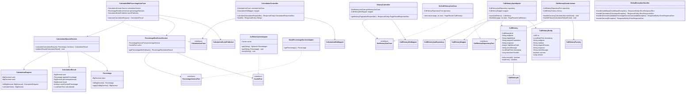

# Diagrama de Clases

```mermaid
classDiagram
    class CalculationController {
        -CalculateUseCase calculateUseCase
        -CalculationDtoMapper mapper
        +calculate(CalculationRequestDto) ResponseEntity~CalculationResponseDto~
        +health() ResponseEntity~String~
    }

    class HistoryController {
        -GetHistoryUseCase getHistoryUseCase
        -CallHistoryDtoMapper mapper
        +getHistory(PaginationRequestDto) ResponseEntity~PageResultResponseDto~
    }

    class CalculateWithPercentageUseCase {
        -CalculationDomainService calculationService
        -PercentageResilienceService percentageResolver
        -CalculationEventPublisher eventPublisher
        +execute(CalculationRequest) CalculationResult
    }

    class GetCallHistoryUseCase {
        -CallHistoryRepositoryPort repository
        +execute(int page, int size) PageResult~CallHistory~
    }

    class CalculationDomainService {
        +calculate(CalculationRequest, Percentage, boolean) CalculationResult
        +validateResult(CalculationResult) void
    }

    class PercentageResilienceService {
        -PercentageServicePort percentageService
        -CachePort cache
        +getPercentageWithFallback() PercentageResolutionResult
    }

    class CallHistoryEventListener {
        -CallHistoryRepositoryPort repository
        -CallHistoryFactory factory
        +handleSuccess(CalculationSuccessEvent) void
        +handleFailure(CalculationFailureEvent) void
    }

    class CalculationRequest {
        -BigDecimal num1
        -BigDecimal num2
        +of(BigDecimal, BigDecimal) CalculationRequest
        +calculateSum() BigDecimal
    }

    class CalculationResult {
        -BigDecimal sum
        -Percentage appliedPercentage
        -BigDecimal percentageAmount
        -BigDecimal result
        -boolean usedCachedPercentage
        -LocalDateTime calculatedAt
    }

    class Percentage {
        -BigDecimal value
        +of(BigDecimal) Percentage
        +applyTo(BigDecimal) BigDecimal
    }

    class CallHistory {
        -CallHistoryId id
        -String endpoint
        -String httpMethod
        -String requestParameters
        -String response
        -Integer httpStatusCode
        -String errorMessage
        -LocalDateTime timestamp
        -Long executionTimeMs
        +isSuccessful() boolean
        +hasError() boolean
    }

    class CallHistoryEntity {
        -UUID id
        -LocalDateTime timestamp
        -String endpoint
        -String method
        -String requestParams
        -String response
        -String errorMessage
        -boolean success
        -Long version
    }

    class CallHistoryJpaAdapter {
        -CallHistoryJpaRepository repository
        -CallHistoryMapper mapper
        +save(CallHistory) CallHistory
        +findAll(int page, int size) PageResult~CallHistory~
    }

    class CaffeineCacheAdapter {
        -Cache cache
        +get(String) Optional~Percentage~
        +put(String, Percentage) void
        +evict(String) void
    }

    class MockPercentageServiceAdapter {
        +getPercentage() Percentage
    }

    class GlobalExceptionHandler {
        +handleInvalidInput(InvalidInputException) ResponseEntity~ErrorResponseDto~
        +handleCalculation(CalculationException) ResponseEntity~ErrorResponseDto~
        +handleServiceUnavailable(PercentageServiceUnavailableException) ResponseEntity~ErrorResponseDto~
        +handleGeneral(Exception) ResponseEntity~ErrorResponseDto~
    }

    CalculationController --> CalculateUseCase
    CalculationController --> CalculationDtoMapper
    HistoryController --> GetHistoryUseCase
    HistoryController --> CallHistoryDtoMapper
    
    CalculateWithPercentageUseCase ..|> CalculateUseCase
    GetCallHistoryUseCase ..|> GetHistoryUseCase
    
    CalculateWithPercentageUseCase --> CalculationDomainService
    CalculateWithPercentageUseCase --> PercentageResilienceService
    CalculateWithPercentageUseCase --> CalculationEventPublisher
    
    PercentageResilienceService --> PercentageServicePort
    PercentageResilienceService --> CachePort
    
    CallHistoryEventListener --> CallHistoryRepositoryPort
    CallHistoryEventListener --> CallHistoryFactory
    
    CalculationDomainService --> CalculationRequest
    CalculationDomainService --> CalculationResult
    CalculationDomainService --> Percentage
    
    CallHistory --> CallHistoryId
    
    CallHistoryJpaAdapter ..|> CallHistoryRepositoryPort
    CallHistoryJpaAdapter --> CallHistoryJpaRepository
    CallHistoryJpaAdapter --> CallHistoryMapper
    CallHistoryJpaAdapter --> CallHistory
    CallHistoryJpaAdapter --> CallHistoryEntity
    
    CaffeineCacheAdapter ..|> CachePort
    MockPercentageServiceAdapter ..|> PercentageServicePort
    
    <<interface>> CalculateUseCase
    <<interface>> GetHistoryUseCase
    <<interface>> PercentageServicePort
    <<interface>> CachePort
    <<interface>> CallHistoryRepositoryPort
```
