# Diagrama de Clases

```mermaid
classDiagram
    %% ========================================
    %% CAPA DE INFRAESTRUCTURA - ADAPTADORES DE ENTRADA (REST)
    %% ========================================
    class CalculationController {
        -CalculateUseCase calculateUseCase
        -CalculationDtoMapper mapper
        +calculate(CalculationRequestDto) ResponseEntity~CalculationResponseDto~
        +health() ResponseEntity~String~
    }

    class HistoryController {
        -GetHistoryUseCase getHistoryUseCase
        -CallHistoryDtoMapper mapper
        +getHistory(PaginationRequestDto) ResponseEntity~PageResultResponseDto~
    }

    %% ========================================
    %% CAPA DE APLICACIÓN - CASOS DE USO
    %% ========================================
    class CalculateWithPercentageUseCase {
        -CalculationDomainService calculationService
        -PercentageResilienceService percentageResolver
        -CalculationEventPort eventPublisher
        -Counter successCounter
        -Counter failureCounter
        +execute(CalculationRequest) CalculationResult
        -resolvePercentage() PercentageResolutionResult
    }

    class GetCallHistoryUseCase {
        -CallHistoryRepositoryPort repository
        +execute(int page, int size) PageResult~CallHistory~
    }

    %% ========================================
    %% CAPA DE DOMINIO - SERVICIOS
    %% ========================================
    class CalculationDomainService {
        +calculate(CalculationRequest, Percentage, boolean) CalculationResult
        +validateResult(CalculationResult) void
    }

    class PercentageResilienceService {
        -PercentageServicePort percentageService
        -CachePort cache
        +getPercentageWithFallback() PercentageResolutionResult
        -tryGetFromService() Optional~Percentage~
        -getFromCache() Optional~Percentage~
    }

    %% ========================================
    %% CAPA DE DOMINIO - VALUE OBJECTS
    %% ========================================
    class CalculationRequest {
        -BigDecimal num1
        -BigDecimal num2
        +of(BigDecimal, BigDecimal) CalculationRequest
        +calculateSum() BigDecimal
        +validate() void
    }

    class CalculationResult {
        -BigDecimal sum
        -Percentage appliedPercentage
        -BigDecimal percentageAmount
        -BigDecimal result
        -boolean usedCachedPercentage
        -LocalDateTime calculatedAt
        +builder() CalculationResultBuilder
    }

    class Percentage {
        -BigDecimal value
        +of(BigDecimal) Percentage
        +applyTo(BigDecimal) BigDecimal
        +getValue() BigDecimal
        +validate() void
    }

    %% ========================================
    %% CAPA DE DOMINIO - MODELO
    %% ========================================
    class CallHistory {
        -CallHistoryId id
        -String endpoint
        -String httpMethod
        -String requestParameters
        -String response
        -Integer httpStatusCode
        -String errorMessage
        -LocalDateTime timestamp
        -Long executionTimeMs
        -Long version
        +isSuccessful() boolean
        +hasError() boolean
    }

    class CallHistoryId {
        -UUID value
        +generate() CallHistoryId
        +of(UUID) CallHistoryId
    }

    %% ========================================
    %% CAPA DE DOMINIO - EVENTOS
    %% ========================================
    class CalculationSuccessEvent {
        -CalculationRequest request
        -CalculationResult result
        -String endpoint
        -String httpMethod
        -LocalDateTime timestamp
    }

    class CalculationFailureEvent {
        -CalculationRequest request
        -String errorMessage
        -String errorCode
        -String endpoint
        -String httpMethod
        -Integer httpStatusCode
        -LocalDateTime timestamp
    }

    %% ========================================
    %% CAPA DE DOMINIO - PUERTOS DE ENTRADA (IN)
    %% ========================================
    class CalculateUseCase {
        <<interface>>
        +execute(CalculationRequest) CalculationResult
    }

    class GetHistoryUseCase {
        <<interface>>
        +execute(int page, int size) PageResult~CallHistory~
    }

    %% ========================================
    %% CAPA DE DOMINIO - PUERTOS DE SALIDA (OUT)
    %% ========================================
    class CalculationEventPort {
        <<interface>>
        +publishSuccess(CalculationRequest, CalculationResult) void
        +publishFailure(CalculationRequest, Exception) void
    }

    class CallHistoryRepositoryPort {
        <<interface>>
        +save(CallHistory) CallHistory
        +findAll(int page, int size) PageResult~CallHistory~
    }

    class CachePort {
        <<interface>>
        +get(String key) Optional~Percentage~
        +put(String key, Percentage value) void
        +evict(String key) void
    }

    class PercentageServicePort {
        <<interface>>
        +getCurrentPercentage() Percentage
    }

    %% ========================================
    %% CAPA DE INFRAESTRUCTURA - ADAPTADORES DE SALIDA (EVENTOS)
    %% ========================================
    class CalculationEventPublisher {
        -ApplicationEventPublisher applicationEventPublisher
        -HttpRequestContextProvider contextProvider
        +publishSuccess(CalculationRequest, CalculationResult) void
        +publishFailure(CalculationRequest, Exception) void
        -extractErrorCode(Exception) String
        -determineHttpStatusCode(Exception) Integer
    }

    class CallHistoryEventListener {
        -CallHistoryRepositoryPort repository
        -CallHistoryFactory factory
        +handleSuccess(CalculationSuccessEvent) void
        +handleFailure(CalculationFailureEvent) void
    }

    %% ========================================
    %% CAPA DE INFRAESTRUCTURA - FACTORY
    %% ========================================
    class CallHistoryFactory {
        -ObjectMapper objectMapper
        +createFromSuccess(CalculationSuccessEvent) CallHistory
        +createFromFailure(CalculationFailureEvent) CallHistory
        -serializeToJson(Object) String
    }

    %% ========================================
    %% CAPA DE INFRAESTRUCTURA - ADAPTADORES DE SALIDA (PERSISTENCIA)
    %% ========================================
    class CallHistoryJpaAdapter {
        -CallHistoryJpaRepository repository
        -CallHistoryMapper mapper
        +save(CallHistory) CallHistory
        +findAll(int page, int size) PageResult~CallHistory~
    }

    class CallHistoryEntity {
        -UUID id
        -LocalDateTime timestamp
        -String endpoint
        -String method
        -String requestParams
        -String response
        -String errorMessage
        -boolean success
        -Long version
    }

    class CallHistoryJpaRepository {
        <<interface>>
        +save(CallHistoryEntity) CallHistoryEntity
        +findAll(Pageable) Page~CallHistoryEntity~
    }

    %% ========================================
    %% CAPA DE INFRAESTRUCTURA - ADAPTADORES DE SALIDA (CACHÉ)
    %% ========================================
    class CaffeineCacheAdapter {
        -Cache~String, Percentage~ cache
        +get(String key) Optional~Percentage~
        +put(String key, Percentage value) void
        +evict(String key) void
    }

    %% ========================================
    %% CAPA DE INFRAESTRUCTURA - ADAPTADORES DE SALIDA (SERVICIO EXTERNO)
    %% ========================================
    class MockPercentageServiceAdapter {
        -Random random
        -PercentageServiceProperties properties
        +getCurrentPercentage() Percentage
        -shouldSimulateFailure() boolean
    }

    %% ========================================
    %% CAPA DE INFRAESTRUCTURA - MANEJO DE EXCEPCIONES
    %% ========================================
    class GlobalExceptionHandler {
        +handleInvalidInput(InvalidInputException) ResponseEntity~ErrorResponseDto~
        +handleCalculation(CalculationException) ResponseEntity~ErrorResponseDto~
        +handleServiceUnavailable(PercentageServiceUnavailableException) ResponseEntity~ErrorResponseDto~
        +handleGeneral(Exception) ResponseEntity~ErrorResponseDto~
    }

    %% ========================================
    %% RELACIONES - CONTROLADORES
    %% ========================================
    CalculationController --> CalculateUseCase : uses
    HistoryController --> GetHistoryUseCase : uses
    
    %% ========================================
    %% RELACIONES - CASOS DE USO IMPLEMENTAN PUERTOS
    %% ========================================
    CalculateWithPercentageUseCase ..|> CalculateUseCase : implements
    GetCallHistoryUseCase ..|> GetHistoryUseCase : implements
    
    %% ========================================
    %% RELACIONES - CASOS DE USO DEPENDEN DE SERVICIOS Y PUERTOS
    %% ========================================
    CalculateWithPercentageUseCase --> CalculationDomainService : uses
    CalculateWithPercentageUseCase --> PercentageResilienceService : uses
    CalculateWithPercentageUseCase --> CalculationEventPort : uses
    
    %% ========================================
    %% RELACIONES - SERVICIOS DE DOMINIO
    %% ========================================
    PercentageResilienceService --> PercentageServicePort : uses
    PercentageResilienceService --> CachePort : uses
    CalculationDomainService --> CalculationRequest : uses
    CalculationDomainService --> CalculationResult : creates
    CalculationDomainService --> Percentage : uses
    
    %% ========================================
    %% RELACIONES - EVENTOS Y LISTENERS
    %% ========================================
    CalculationEventPublisher ..|> CalculationEventPort : implements
    CalculationEventPublisher --> CalculationSuccessEvent : creates
    CalculationEventPublisher --> CalculationFailureEvent : creates
    CallHistoryEventListener --> CalculationSuccessEvent : listens
    CallHistoryEventListener --> CalculationFailureEvent : listens
    CallHistoryEventListener --> CallHistoryRepositoryPort : uses
    CallHistoryEventListener --> CallHistoryFactory : uses
    
    %% ========================================
    %% RELACIONES - FACTORY
    %% ========================================
    CallHistoryFactory --> CallHistory : creates
    CallHistoryFactory --> CalculationSuccessEvent : uses
    CallHistoryFactory --> CalculationFailureEvent : uses
    
    %% ========================================
    %% RELACIONES - MODELO
    %% ========================================
    CallHistory --> CallHistoryId : contains
    
    %% ========================================
    %% RELACIONES - ADAPTADORES IMPLEMENTAN PUERTOS
    %% ========================================
    CallHistoryJpaAdapter ..|> CallHistoryRepositoryPort : implements
    CallHistoryJpaAdapter --> CallHistoryJpaRepository : uses
    CallHistoryJpaAdapter --> CallHistory : uses
    CallHistoryJpaAdapter --> CallHistoryEntity : uses
    
    CaffeineCacheAdapter ..|> CachePort : implements
    MockPercentageServiceAdapter ..|> PercentageServicePort : implements
    
    %% ========================================
    %% RELACIONES - REPOSITORY PORT
    %% ========================================
    GetCallHistoryUseCase --> CallHistoryRepositoryPort : uses
```

## Descripción de Capas

### Capa de Infraestructura (Infrastructure Layer)
**Adaptadores de Entrada (In):**
- `CalculationController`, `HistoryController`: Exponen API REST

**Adaptadores de Salida (Out):**
- **Eventos**: `CalculationEventPublisher`, `CallHistoryEventListener`
- **Persistencia**: `CallHistoryJpaAdapter`, `CallHistoryEntity`, `CallHistoryJpaRepository`
- **Caché**: `CaffeineCacheAdapter`
- **Servicio Externo**: `MockPercentageServiceAdapter`

**Factory:**
- `CallHistoryFactory`: Crea entidades CallHistory desde eventos (usa Jackson, por eso está en infraestructura)

**Excepciones:**
- `GlobalExceptionHandler`: Maneja excepciones globalmente

### Capa de Aplicación (Application Layer)
- `CalculateWithPercentageUseCase`: Orquesta el cálculo con porcentaje
- `GetCallHistoryUseCase`: Orquesta la consulta de historial

### Capa de Dominio (Domain Layer)
**Puertos de Entrada (In):**
- `CalculateUseCase`, `GetHistoryUseCase`: Definen contratos de casos de uso

**Puertos de Salida (Out):**
- `CalculationEventPort`: Puerto para publicación de eventos
- `CallHistoryRepositoryPort`: Puerto para persistencia de historial
- `CachePort`: Puerto para operaciones de caché
- `PercentageServicePort`: Puerto para servicio de porcentajes

**Servicios de Dominio:**
- `CalculationDomainService`: Lógica pura de cálculo
- `PercentageResilienceService`: Estrategia de resiliencia con fallback

**Value Objects:**
- `CalculationRequest`, `CalculationResult`, `Percentage`

**Modelo:**
- `CallHistory`, `CallHistoryId`: Agregado de historial

**Eventos:**
- `CalculationSuccessEvent`, `CalculationFailureEvent`: Eventos de dominio

## Principios Arquitectónicos Aplicados

### 1. Hexagonal Architecture (Ports & Adapters)
- **Puertos (Interfaces)**: Definen contratos en el dominio
- **Adaptadores (Implementaciones)**: En la capa de infraestructura
- **Inversión de dependencias**: Infraestructura depende del dominio, no al revés

### 2. Domain-Driven Design (DDD)
- **Value Objects**: Inmutables con validación incorporada
- **Aggregates**: CallHistory con su CallHistoryId
- **Domain Services**: Lógica de negocio pura sin dependencias externas
- **Domain Events**: CalculationSuccessEvent, CalculationFailureEvent

### 3. Clean Architecture
- **Dominio libre de frameworks**: Sin anotaciones Spring en value objects
- **Factory en infraestructura**: CallHistoryFactory usa Jackson (dependencia externa)
- **Event Publisher en infraestructura**: Usa Spring ApplicationEventPublisher

### 4. Event-Driven Architecture
- **Publicación mediante puerto**: CalculationEventPort
- **Implementación con Spring Events**: CalculationEventPublisher
- **Procesamiento asíncrono**: CallHistoryEventListener con @Async

### 5. Separation of Concerns
- **Controladores**: Solo conversión DTO ↔ Domain
- **Casos de Uso**: Orquestación sin lógica de negocio
- **Servicios de Dominio**: Lógica de negocio pura
- **Adaptadores**: Detalles de implementación técnica
