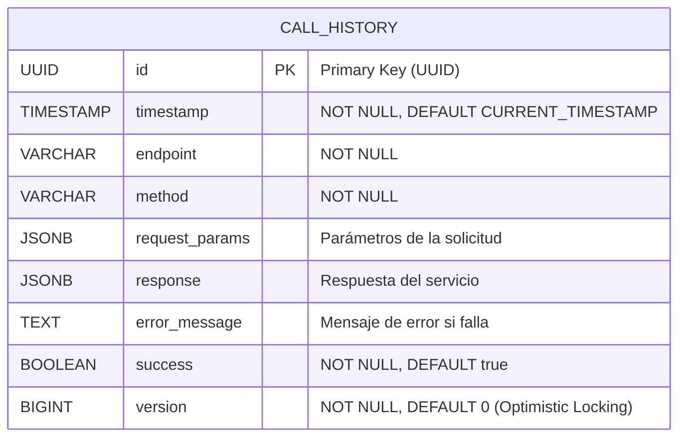

# Diagrama de Base de Datos

## Índices Creados

La tabla `call_history` tiene los siguientes índices para optimizar las consultas:

### Índices B-Tree
Estos índices optimizan las búsquedas por igualdad y rangos:

- **`idx_timestamp`**: Índice en columna `timestamp` (ordenado DESC)
  - **Propósito**: Optimizar consultas ordenadas por fecha más reciente
  - **Casos de uso**: `ORDER BY timestamp DESC`, filtros por rango de fechas
  - **Tipo**: B-Tree descendente

- **`idx_endpoint`**: Índice en columna `endpoint`
  - **Propósito**: Filtrar llamadas por endpoint específico
  - **Casos de uso**: `WHERE endpoint = '/api/v1/calculate'`
  - **Tipo**: B-Tree

- **`idx_success`**: Índice en columna `success`
  - **Propósito**: Separar llamadas exitosas de fallidas
  - **Casos de uso**: `WHERE success = true/false`
  - **Tipo**: B-Tree

### Índices GIN (Generalized Inverted Index)
Estos índices optimizan búsquedas dentro de campos JSONB:

- **`idx_request_params_gin`**: Índice GIN en columna `request_params` (JSONB)
  - **Propósito**: Búsquedas eficientes dentro del JSON de parámetros
  - **Casos de uso**: 
    - `WHERE request_params @> '{"num1": 10}'`
    - `WHERE request_params ? 'num2'`
    - Búsqueda de valores específicos en los parámetros
  - **Tipo**: GIN

- **`idx_response_gin`**: Índice GIN en columna `response` (JSONB)
  - **Propósito**: Búsquedas eficientes dentro del JSON de respuesta
  - **Casos de uso**:
    - `WHERE response @> '{"result": 34.50}'`
    - `WHERE response ? 'appliedPercentage'`
    - Análisis de resultados específicos
  - **Tipo**: GIN

## Características de la Tabla

### Identificación
- **Clave Primaria**: UUID generada automáticamente
  - Beneficios: Distribución uniforme, no secuencial, compatible con sistemas distribuidos

### Campos de Auditoría
- **`timestamp`**: Fecha y hora de creación del registro
  - Valor por defecto: `CURRENT_TIMESTAMP`
  - Permite rastrear cuando ocurrió cada llamada

- **`version`**: Campo para control de concurrencia optimista
  - Valor inicial: 0
  - Incrementa en cada actualización
  - Previene condiciones de carrera en actualizaciones concurrentes

### Almacenamiento JSON
- **JSONB vs JSON**: Se usa JSONB (Binary JSON) por:
  - Mayor eficiencia en consultas
  - Soporte para indexación GIN
  - Almacenamiento comprimido
  - Validación de estructura al insertar

### Campos Condicionales
- **`error_message`**: Solo contiene valor si `success = false`
- **`response`**: Solo contiene valor si `success = true`
- **`request_params`**: Siempre contiene los parámetros de entrada