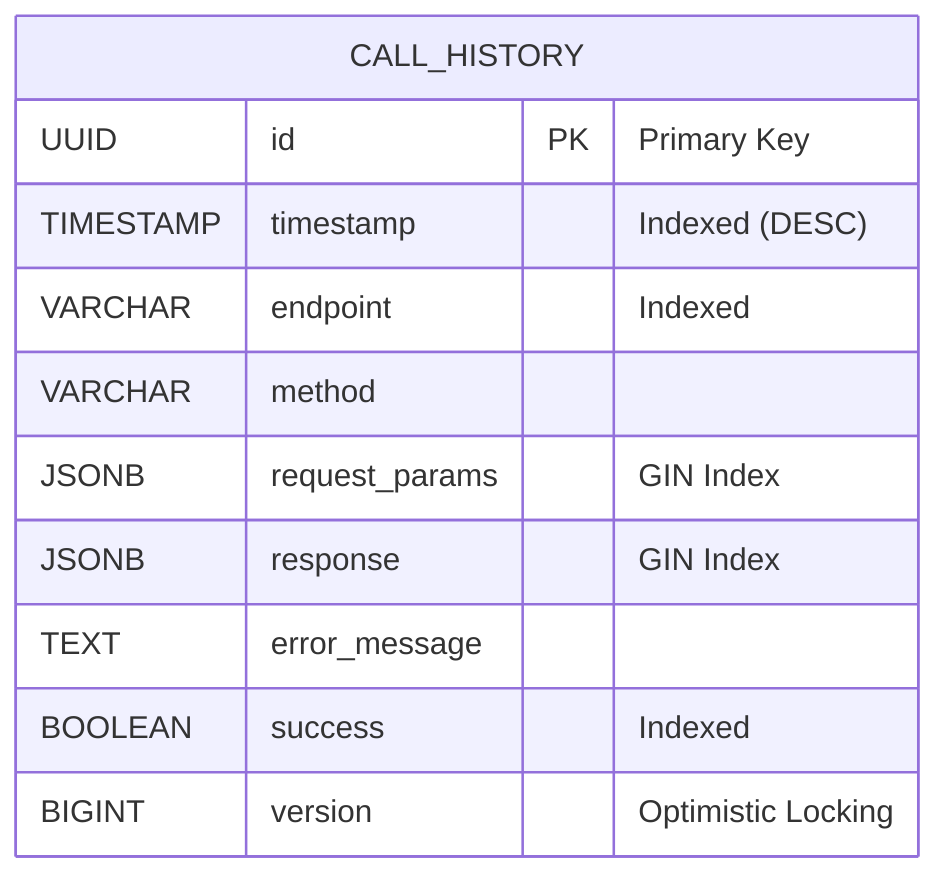

# Diagrama de Base de Datos

## Índices Creados

La tabla `call_history` tiene los siguientes índices para optimizar las consultas:

### Índices B-Tree
- **idx_timestamp**: Índice en columna `timestamp` (ordenado DESC) para consultas por fecha
- **idx_endpoint**: Índice en columna `endpoint` para filtrar por endpoint
- **idx_success**: Índice en columna `success` para filtrar por estado

### Índices GIN (Generalized Inverted Index)
- **idx_request_params_gin**: Índice GIN en columna `request_params` (JSONB) para búsquedas dentro del JSON
- **idx_response_gin**: Índice GIN en columna `response` (JSONB) para búsquedas dentro del JSON

## Características de la Tabla

- **Clave Primaria**: UUID generada automáticamente
- **Timestamp**: Fecha y hora de creación del registro con valor por defecto `CURRENT_TIMESTAMP`
- **JSONB**: Soporte para almacenar datos JSON con índices GIN para búsquedas eficientes
- **Versionado Optimista**: Campo `version` para control de concurrencia
